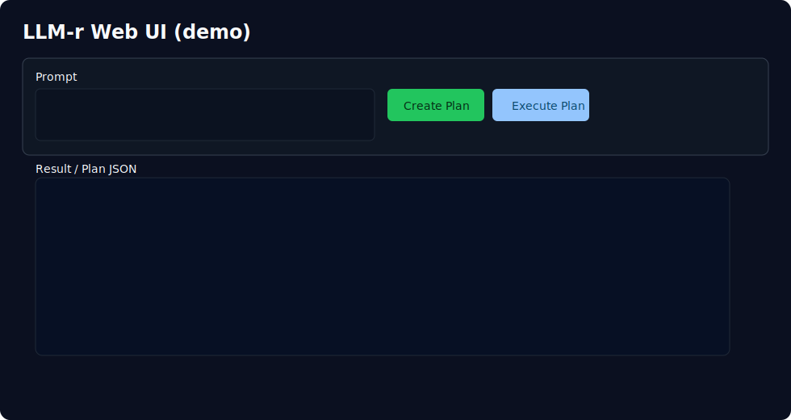

# LLM-r 1.3.0

LLM-r bridges **Ableton Live** and an LLM using AbletonOSC + modelito.

## What's improved in 1.3.0

- Added **persistent plan storage** to disk (`LLMR_PLAN_STORE_PATH`, default `.llmr/plans.json`).
- Plans now survive process restarts and still respect TTL pruning behavior.
- Added `GET /api/plan/{plan_id}` for plan audit/retrieval after creation.
- Added `dry_run` option to `POST /api/execute` so users can validate execution payloads without sending OSC.
- Added stricter prompt validation (`min_length`, `max_length`) and prompt trimming.
- Kept lifecycle safety: TTL plan pruning, bounded store, destructive approval, and no double execution.
- Kept macro workflow (`/api/macros`, `/api/plan_macro`) plus dry-run and approval controls.

## API

- `GET /health`
- `GET /api/capabilities`
- `GET /api/macros`
- `POST /api/plan`
- `POST /api/plan_macro`
- `GET /api/plan/{plan_id}`
- `POST /api/execute`

## Environment

- `LLMR_PLAN_STORE_PATH` (default `.llmr/plans.json`)
- `LLMR_ABLETON_HOST`, `LLMR_ABLETON_PORT`
- `LLMR_PROVIDER`, `LLMR_MODEL`

## Run

```bash
python backend/main.py
```

Open `http://localhost:8787`.

## Screenshots


